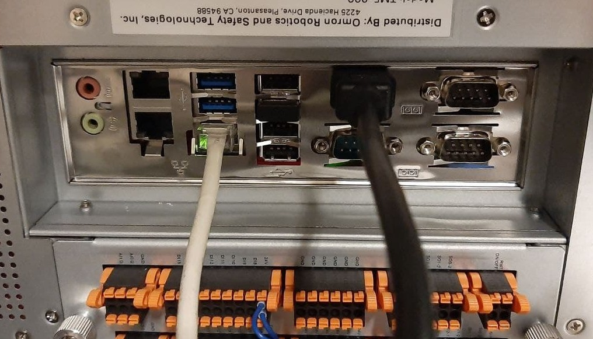

# __User Guide for TM ROS Driver__

This repo is forked from [tmr_ros1]( https://github.com/TechmanRobotInc/tmr_ros1) that provides ROS support for techman robots. The original repo has been further developed using the existing driver to simulate and handle an __external obstacle detection__. <br/>
Specifically the repo has been tested for cobot __TM5-900__ with __TMFlow 1.82.5100__ __ROS Melodic__ under __Ubuntu 18.04__.<br/>

For further information about the existing ROS driver refers to [tmr_ros1]( https://github.com/TechmanRobotInc/tmr_ros1); for details about the project refers to [report](src/documents/Report.pdf).<br/>

## __1.ROS Driver__

The existing TM ROS driver is a __single ROS node__ that handles robot(TMFlow)-pc(ROS) communication through an ethernet cable (rj45), implementing the TCP/IP communication protocols described in [espression_editor](src/documents/i848_tm_expression_editor_and_listen_node_reference_manual.pdf).  In details the driver connects to _TMflow Ethernet Slave_ and to a _Listen node_ running at a _TMflow project_. Thanks to this the user can get the robot state and can control the robot using _External Script_. <br/>
The TM ROS driver node also offers the following interfaces:

> __Action Server__
>
> - An  action interface on _/follow_joint_trajectory_ for integration with MoveIt; the action allows the execution of the trajectory planned on Moveit
>
> __Topic Publisher__
>
> - publish feedback state on _/feedback_states_  
feedback state include robot position, error code, io state, etc.
(see _tm_msgs/msg/FeedbackState.msg_)  
> - publish joint states on _/joint_states_  
> - publish tool pose on _/tool_pose_
>
> __Service Server__
>
> - _/tm_driver/send_script_ (see _tm_msgs/srv/SendScript.srv_) :  
send external script to _Listen node_  
> - _/tm_driver/set_event_ (see _tm_msgs/srv/SetEvent.srv_) :  
send command like "Stop", "Pause" and "Resume"  to _Listen node_  
> - _/tm_driver/set_io_ (see _tm_msgs/srv/SetIO.srv_) :  
send digital or analog output value to _Listen node_  
> - _/tm_driver/set_position (see _tm_msgs/srv/SetPosition.srv_) :  
send motion command to _Listen node_, the motion type include PTP, LINE, CIRC ans PLINE, the position value is joint angle(__J__) or tool pose(__T__), see [[Expression Editor and Listen Node.pdf]]
>
>

## __2. Setup__
The steps to connect to the robot and to test the code are the following:

### &sect; __Ubuntu 18.04 Virtual Machine setup__
If necessary create a virtual machine with Ubuntu 18.04 (Bionic). The steps to create the virtual machine with VirtualBox can be found in [Ubuntu](https://www.toptechskills.com/linux-tutorials-courses/how-to-install-ubuntu-1804-bionic-virtualbox/).
It is raccomended to give the virtual machine at least half the RAM of the host and to reserve about 30GB for the virtual hard disk.
It is suggested to install the _VirtualBox Guest Additions_. <br/>


To allow the TCP/IP connection with the robot it is required to modify the default network settings.  <br/>
The default virtual network adapter uses __NAT__ (Network Address Translation) mode.
With this mode the guest operating system can access external networks, including the internet, but the guest machine is not accessible from the outside.


So a new virtual network adapter that uses __Bridged Adapter__ must be enabled. With this mode packets are sent and received directly from/to the virtual network adapter without additional routing so that the VM can be accessed from other hosts connected to the physical network.<br/>
The correct network adapter must be selected (the physical adapter used for the connection with the robot).


Finally a proper __static IP__ address must be assigned to the VM so that the VM and the robot belong to the same private network.


### &sect; __ROS Melodic setup__
The steps to install ROS Melodic on Ubuntu can be found in [Melodic](http://wiki.ros.org/melodic/Installation/Ubuntu). The steps from 1.1 to 1.5 are sufficient. It is recommanded to install the _Desktop-Full_ version to prevent installing manually missing packages. <br/>
Despite this, some packages (such as Moveit) could still be missing, giving error at compile time. They can be installed with the following command:

```
sudo apt install ros-melodic-PACKAGE
```
If ROS Melodic is the only ROS version curruntly used, it is suggested to modify the _.bashrc_ file to automatically add the ROS environment variables to your bash session every time a new shell is launched (step 1.5 of [Melodic](http://wiki.ros.org/melodic/Installation/Ubuntu)).

```
echo "source /opt/ros/melodic/setup.bash" >> ~/.bashrc
source ~/.bashrc
```

Otherwise it must be source in every new shell in order to use ROS commands.
```
source /opt/ros/melodic/setup.bash
```


### &sect; __Download and copile the repository__
Download the git repository, unzip it and copy just the _src_ folder into your working directory.<br/>
Open the terminal from the _src_ folder of your working directory and compile the workspace with the following command:

```
catkin_make
```
The compilation creates the two new folder _build_ and _devel_.
It is suggested to modify the _.bashrc_ file to automatically add the workspace enviroment to your bash session every time a new shell is launched. Otherwise it must be source in every new shell in order to launch launch files or run nodes.

```
source [PATH]/[WORKING_DIRECTORY_NAME]/devel/setup.bash
```


###  &sect; __Physical connection to TM ROBOT__
The robot and the pc must be physically connected through an ethernet cable (rj45).
:bulb:__WARNING__ __Connect__ the ethernet cable to the __LAN__ port of the control box.

 | 

### &sect; __TMFlow setup__
On the robot side the steps to enable the communication are the following:

1. Create a new TMFlow project with an infinite loop on a __Listen__ node. Just drag the node from the _nodes menu_, the node parameters can be left to their default value.


When the process enters the Listen Node, it stays in the Listen Node until it triggers and leaves with one of the two exit condition:
__Pass__: executes ScriptExit() or item stopped
__Fail__: connection Timeout or data Timeout or before the Socket Server been established successfully, the flow process has entered the Listen Node
So then connect the _Fail Path_ to a _Stop_ node and the _Pass Path_ to a _Goto_ node to loop back to the listen node.

 

2. The `Network` settings in __System &rArr; Network__ can be left to their __default__ value.
This step is different from what [tmr_ros1]( https://github.com/TechmanRobotInc/tmr_ros1) describes. Connecting the ethernet cable to the only one __LAN__ port (not the GigE ports) of the control box, the Ethernet Slave and the Listen open on __169.254.77.215__.
It is sufficient to set the static ip of the Virtual Machine so that it belongs to the same private network (for example 169.254.77.210).

 

:bulb:__WARNING__ __Not connect__ the ethernet cable to a __GigE LAN__ port otherwise the Ethernet Slave and the Listen open on the local host 127.0.0.1 and the connection fails <br/>
:bulb:__WARNING__ If the Ethernet Slave and the Listen still open on the local host 127.0.0.1 try the other port though


3. Enable the __Ethenet Slave__ and set the __Ethernet Slave Data Table__ from __Setting &rArr; Connection &rArr; Ethernet Slave__.

 

 The __Data Table__ or __Transmit File__ is a customizable list of items that are trasmitted between the Ethernet Slave and clients. In particular when the Ethernet Slave is enabled, the data items in this file are send to the connected clients periodically. <br/>
 These items can be __predefined__ variables, __user defined__ variable or __global variable__. <br/>
 The following items must be selected and added to the transmit file:

- [x] Robot_Error
- [x] Project_Run
- [x] Project_Pause
- [x] Safeguard_A
- [x] ESTOP
- [x] Camera_Light
- [x] Error_Code
- [x] Joint_Angle
- [x] Coord_Robot_Flange
- [x] Coord_Robot_Tool
- [x] TCP_Force
- [x] TCP_Force3D
- [x] TCP_Speed
- [x] TCP_Speed3D
- [x] Joint_Speed
- [x] Joint_Torque
- [x] Project_Speed
- [x] MA_Mode
- [x] Robot Light
- [x] Ctrl_DO0~DO7
- [x] Ctrl_DI0~DI7
- [x] Ctrl_AO0
- [x] Ctrl_AI0~AI1
- [x] END_DO0~DO3
- [x] END_DI0~DI2
- [x] END_AI0

 

Another way to set the __Ethernet Slave Data Table__ settings is to directly import the transmit file from [TM ROS Driver vs TMflow software Usage : Import Data Table Setting](https://github.com/TechmanRobotInc/TM_Export).


## __3. Usage__
###  &sect; __TM ROS driver usage__

> __ROS1 driver usage__
>
> After the user has set up the ROS1 environment and built the TM driver based on the specific workspace, please enter your workspace `<workspace>` by launching the terminal, and remember to make the workspace visible to ROS.
>
>
> ```bash
> source /opt/ros/melodic/setup.bash
> cd <workspace>
> source ./devel/setup.bash
> ```
> :bulb: Do you prepare the __TM Robot__ ready ? Make sure that TM Robot's operating software (__TMflow__) network settings are ready and the __Listen node__ is running.
>
> Then, run the driver to maintain the connection with TM Robot by typing
>
>```bash
> rosrun tm_driver tm_driver <robot_ip_address>
>```
> Example :``rosrun tm_driver tm_driver 192.168.10.2``, if the <robot_ip_address> is 192.168.10.2
>
>
> Another way, the user can execute the specific existing launch file (example: __tm5_900_bringup.launch__) to enable the driver to connect to __tm5-900__ robot  
>
> ```bash
> roslaunch tm_driver tm5_900_bringup.launch robot_ip:=<robot_ip_address>
> ```
> Example :``roslaunch tm_driver tm5_900_bringup.launch robot_ip:=192.168.10.2``, if the <robot_ip_address> is 192.168.10.2
>
> Now, the user can use a new terminal to run each ROS node or command, but don't forget to source the correct setup shell files as starting a new terminal.

> __Usage with MoveIt__
>
> See [Moveit tutorial](http://docs.ros.org/en/melodic/api/moveit_tutorials/html/doc/getting_started/getting_started.html).<br/>
>
> To bring up MoveIt environment in simulation mode with virtual TM Robot, by typing
>
>
> ```bash
> roslaunch tm5_900_moveit_config tm5_900_moveit_planning_execution.launch sim:=True
> ```
>
> The user can also manipulate TM Robot in the real world, by typing<br/>
> :bulb: Do you prepare the __TM Robot__ ready ? Make sure that TM Robot's operating software (__TMflow__) network settings are ready and the __Listen node__ is running.  
>
> ```bash
> roslaunch tm5_900_moveit_config tm5_900_moveit_planning_execution.launch sim:=False robot_ip:=<robot_ip_address>
> ```
>
> The parameter `<robot_ip_address>` means the IP address of the TM Robot.<br/>
>:warning:[CAUTION] This demo will let the real TM Robot move, please be careful.<br/>


### &sect; __Demo package description__
> There are some demo codes showing  how to use TM ROS driver.<br/>
>
> * demo_send_script:<br/>
In this demo code, it shows how to send a __Listen node__ script to control the TM Robot. <br/>
The user can use service named "send_script" to send script.<br/>
"id" &rarr; The transaction number expressed in any <u>alphanumeric</u> <sup>1</sup> characters.<br/>
"script" &rarr; the script which the user want to send.<br/>
"ok" &rarr; the correctness of the script.<br/>
 ><sup>1</sup> If a non-alphanumeric byte is encountered, a CPERR 04 error is reported. When used as a communication packet response, it is a transaction number and identifies which group of commands to respond.<br/>
>
> * demo_ask_item:<br/>
In this demo code, the user can use this service to send TMSCT <sup>2</sup> cmd.<br/>
> <sup>2</sup> For more detailed information, please refer to _defined protocol_: Expression Editor and Listen Node.pdf (Chapter7.4 TMSCT)<br/>
>
> * demo_ask_sta:<br/>
In this demo code, the user can use this service to send TMSTA <sup>3</sup> cmd.<br/>
> <sup>3</sup> For more detailed information, please refer to _defined protocol_ (Chapter7.5 TMSTA)<br/>
> * demo_connect_tm:<br/>
In this demo code, the user can set the connection type. <br/>
If the user sets reconnect to true, every time the driver disconnects from the __Listen node__, it will try to reconnect.<br/>
There are two kind connection settings the user can select, one is "connect_tmsvr" for Ethernet server connection, and the other is "connect_tmsct" for  TMflow connection.<br/>
>
> * demo_set_event:<br/>
In this demo code, six event types can be selected.<br/>
func &rarr;  TAG, WAIT_TAG, STOP, PAUSE, RESUME and EXIT<br/>
arg0 &rarr;  if func is TAG or WAIT_TAG, arg0 is timeout in ms<br/>
arg1 &rarr;  if func is TAG or WAIT_TAG, arg1 is id<br/>
>
> * demo_set_io:<br/>
In this demo code, the user should set module, type, pin and state. <sup>4</sup> <br/>
module &rarr;  MODULE_CONTROLBOX or MODULE_ENDEFFECTOR<br/>
type &rarr;  TYPE_DIGITAL_IN, TYPE_DIGITAL_OUT, TYPE_INSTANT_DO, TYPE_ANALOG_IN, TYPE_ANALOG_OUT, TYPE_INSTANT_AO<br/>
pin &rarr;  pin number<br/>
state &rarr;  STATE_OFF or STATE_ON value, or other value (if type expressed in a specific control module)<br/>
> <sup>4</sup> For more detailed information, please refer to _defined protocol_ (Chapter6.5 IO)<br/>
>
> * demo_set_positions:<br/>
In this demo code, the user should pay attention to the parameter definition of the data format setting <sup>5</sup> and the unit of the parameter to be operated.  <br/>
motion_type &rarr;  PTP_J , PTP_T , LINE_J , LINE_T , CIRC_J ,CIRC_T , PLINE_J ,PLINE_T <br/>
positions &rarr;  motion target position: If expressed in Cartesian coordinate (unit: m), if expressed in joint angles (unit: rad)<br/>
velocity &rarr;  motion velocity: if expressed in Cartesian coordinate (unit: m/s) <sup>6</sup> , if expressed in joint velocity (unit: rad/s, and the maximum value is limited to  &pi; )  <sup>6</sup>  <br/>
acc_time &rarr; time to reach maximum speed (unit: ms)<br/>
blend_percentage &rarr; blending value: expressed as a percentage (unit: %, and the minimum value of 0 means no blending) <br/>
fine_goal &rarr; precise position mode : If activated, the amount of error in the final position will converge more, but it will take a few more milliseconds.<br/>
> <sup>5</sup> For more detailed information, please refer to _defined protocol_ (Chapter8 PTP, Line, Circle, Pline, Move_PTP, Move_Line, Move_PLine) <br/>
> <sup>6</sup> The unit of the parameters are different, the user can find the conversion in the program of TM ROS driver.<br/>
>
> * demo_write_item: <br/>
In this demo code, the user can use this service to send TMSVR <sup>7</sup> cmd. <br/>
> <sup>7</sup> For more detailed information, please refer to _defined protocol_ (Chapter9.3 svr_write())<br/>
>
> * demo_leave_listen_node:<br/>
In this demo code, the user can use send_script service sending a script to leave the __Listen node__.<br/>
> :bulb: If the user has sent the demo_leave_listen_node script to leave the __Listen node__, and you want to run the TM Robot again, please remember that the _Listen task_ project should be resumed to run. You can press the Stop Button on the Robot Stick and then press the Play/Pause Button to resume operation. <br/>


### &sect; __Usage with demo code & driver__
> Note: If the user have even successfully built a specific code(tmr_ros1), the user only need to change to the TM driver workspace path  ``cd ~/tmdriver_ws`` , and then directly refer to steps 5~7 below. <br/>
> 1. Type to create a root workspace directory by starting a terminal: For example,  ``tmdriver_ws`` or ``catkin_ws``, then type to change current directory into the workspace directory path.<br/>
``mkdir ~/tmdriver_ws``<br/>
``cd ~/tmdriver_ws``<br/>
> 2. Clone the the TM driver of git repository into the current directory by typing<br/>
``git clone https://github.com/TechmanRobotInc/tmr_ros1.git``<br/>
> 3. After the download done, rename the download folder ``tmr_ros1``(or ``tmr_ros1-master``) to ``src`` by typing<br/>
``mv tmr_ros1 src``<br/>  (or right-click on the download folder, select "Rename...")<br/>
> 4. At the workspace directory to build the download packages and source 'setup.bash' in this workspace to make the worksapce visible to ROS of this terminal 1.<br/>
Note: Do you set``source /opt/ros/melodic/setup.bash`` ready? Make sure to obtain the correct setup file according to your workspace hierarchy, and then type the following below to compile.<br/>
``catkin_make``<br/>
``source ./devel/setup.bash``<br/>
> 5. Terminal 1: Startup ROS core  and type<br/>
``roscore``<br/>
> 6. In a new terminal 2: Source setup.bash in the workspace path and run the driver to connect to TM Robot by typing<br/>
``source ./devel/setup.bash``<br/>
``rosrun tm_driver tm_driver <robot_ip_address>``<br/>
The <robot_ip_address> is the IP address of the TM Robot, the user can get it through TM Flow, for example 192.168.10.2<br/>
> 7. In another new terminal: Source setup.bash in the workspace path and type specific demo node function which the user want to study for applications. For example: the user select to run demo_set_io, the user can type<br/>
``source ./devel/setup.bash``<br/>
``rosrun demo demo_set_io``<br/>
>:warning:[CAUTION] Some demos will let the TM Robot move, please be careful.<br/>
><br/>
